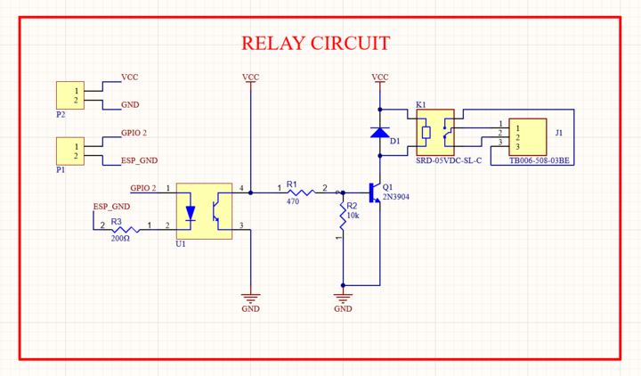

| Supported Targets | ESP32 | 
| ----------------- | ----- | 

# ESP-I/O-Control-Device

This project schedules ON time of a Relay(GPIO) connecting to the broker URI selected using `idf.py menuconfig` (using mqtt tcp transport) 


It uses ESP-MQTT library which implements mqtt client to connect to mqtt broker. Furthermore, it uses ntp library to get current time for it's proper functioning. Also ESP32 non-volatile is also used to store the schedule in case connection is disconnected.

## How to use this project

### Software Required
* Visual Studio Code IDE [link](https://code.visualstudio.com/download)
* ESP-IDF version 5.0.2 [link](https://dl.espressif.com/dl/esp-idf/)
* Latest version of Mosquitto [link](https://mosquitto.org/download/)
### Hardware Required
* ESP-32 DEVKITV1 development board
* A Relay module
* If you don't have a relay module then make a circuit using the following schematic:

* 2 female to female jumper wires

### Configure the project

* Open the project configuration menu (`idf.py menuconfig`)
* Configure Wi-Fi or Ethernet under "Example Connection Configuration" menu. Under the `SSID` enter the name ofd your Wi-Fi and under the `PASSWORD` section under password of your WiFi network.
* In the `KConfig.projbuild` file enter the URL of the broker you want to use. Default is `mqtt://mqtt.eclipseprojects.io`

### Build and Flash

Build the project using:
```
idf.py build
```
 Then flash it to the board, then run monitor tool to view serial output:

```
idf.py -p PORT flash monitor
```

(To exit the serial monitor, type ``Ctrl-]``.)

### Publishing and Subscribing to the broker
* Using the Command Prompt Navigate to the folder where you have installed Mosquitto broker

* To subscribe to the topic enter the command:
```
mosquitto_sub -h mqtt.eclipseprojects.io -t time_topic
```
* To Publish an epoch time to the topic enter command:
```
mosquitto_pub -h mqtt.eclipseprojects.io -t time_topic -m EPOCH time
```